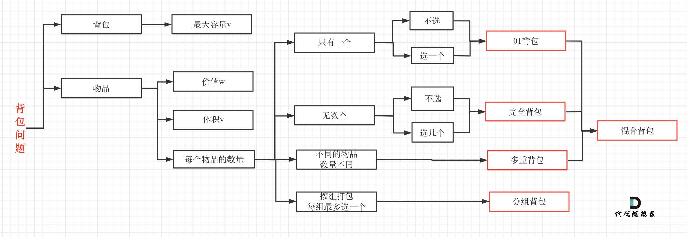

# Leetcode Notes

- [Leetcode Notes](#leetcode-notes)
  - [1. Backtracking](#1-backtracking)
    - [1.1 Selected Questions](#11-selected-questions)
    - [1.2 Backtracking Template](#12-backtracking-template)
  - [2. Binary Tree & Divide Conquer](#2-binary-tree--divide-conquer)
    - [2.1 Selected Questions](#21-selected-questions)
    - [2.2 Recursion in Binary Tree](#22-recursion-in-binary-tree)
    - [2.3 Time Complexity Analysis](#23-time-complexity-analysis)
  - [3. Binary Search](#3-binary-search)
    - [3.1 Selected Questions](#31-selected-questions)
    - [3.2 Binary Search Template](#32-binary-search-template)
  - [4. BFS](#4-bfs)
    - [4.1 Selected Questions](#41-selected-questions)
    - [4.2 BFS Template](#42-bfs-template)
  - [5. DFS](#5-dfs)
    - [5.1 Selected Questions](#51-selected-questions)
    - [5.2 BFS/DFS Complexity Analysis](#52-bfsdfs-complexity-analysis)
  - [6. Linked List](#6-linked-list)
    - [6.1 Selected Questions](#61-selected-questions)
  - [7. Array](#7-array)
    - [7.1 Selected Questions](#71-selected-questions)
    - [7.2 Array Question Summary](#72-array-question-summary)
  - [8. Hash & Heap](#8-hash--heap)
    - [8.1 Selected Questions](#81-selected-questions)
    - [8.2 Python Implementation of Heap/Priority Queue](#82-python-implementation-of-heappriority-queue)
  - [9. Dynamic Programming](#9-dynamic-programming)
    - [9.1 Fundamental Questions](#91-fundamental-questions)
    - [9.2 DP Question Summary](#92-dp-question-summary)
    - [9.3 Problem Solving Steps](#93-problem-solving-steps)

---

## 1. Backtracking

<br/>

### 1.1 Selected Questions

<br/>

[78. Subsets](src/78.subsets.py)

[90. Subsets II](src/90.subsets-ii.py)

[46. Premutation](src/46.permutations.py)

[47. Permutation II *](src/47.permutations-ii.py)

[39. Combination Sum](src/39.combination-sum.py)

[40. Combination Sum II](src/40.combination-sum-ii.py)

[216. Combination Sum III](src/216.combination-sum-iii.py)

[131. Palindrome Partitioning *](src/131.palindrome-partitioning.py)

[17. Letter Combination of a Phone Number](src/17.letter-combinations-of-a-phone-number.py)

[93. Restore IP Address](src/93.restore-ip-addresses.py)

[698. Partition to K Equal Sum Subsets](src/698.partition-to-k-equal-sum-subsets.py)

[22. Generate Parentheses](src/22.generate-parentheses.py)

[79. Word Search](src/79.word-search.py)

<br/>

### 1.2 Backtracking Template

<br/>
    
```python
def helper(input, results, cur, startIndex):
    if return_condition:
        results.append(cur[:])  # deep copy
        return
    for i in range(startIndex, len(input)):
        if continue_condition:
            continue
        update startIndex
        update cur
        helper(input, results, cur, startIndex)
        recover cur  # backtracking

def mainFunction(input):
    results = []
    cur = []
    helper(input, results, cur, 0)
    return results
```

Notes:

1. How to update `startIndex`?
    
    Objective: distinguish two adjacent recursion 
    
    - `startIndex := i + 1`
        - `cur` has all or part of elements in `input`. Each element appears **at most once**.
        - Subsets I/II, Palindrome Partitioning, Restore IP Address
    - `startIndex := i`
        - `cur` has all or part of elements in `input`. Each element could appear **multiple times**.  
        - Combination Sum
    - `seen`
        - `cur` has all elements in `input` **once**.
        - Permutation I/II, Combination Sum II

    - Don't need `startIndex`, i.e., `startIndex` always equals to 0.
        - Letter Combination of a Phone Number

2. Condition to append `cur` to `results` (return_condition)

    - Always: e.g. Subsets
    - `len(cur) == len(input)`: e.g. Permutation
    - `startIndex == len(input)`: e.g. Palindrom Partitioning
    - Other conditions based on question requirements

3. Condition to avoid appending new element to `cur` (continue_condition)

    - Remove duplicate: Subsets II, Permutation II, etc.
    - Seen element: Permutation
    -  Other conditions based on question requirements

## 2. Binary Tree & Divide Conquer

<br/>

### 2.1 Selected Questions

<br/>

[94. Binary Tree Inorder Traversal](src/94.binary-tree-inorder-traversal.py)

[144. Binary Tree Preorder Traversal](src/144.binary-tree-preorder-traversal.py)

[145. Binary Tree Postorder Traversal *](src/145.binary-tree-postorder-traversal.py)

[257. Binary Tree Paths](src/257.binary-tree-paths.py)

[596. Minimum Subtree (Lintcode)](src/L596.minimum-subtree.py)

[110. Balanced Bianry Tree](src/110.balanced-binary-tree.py)

1120 Maximum Average Subtree $

[236. Lowest Common Ancestor of a Binary Tree](src/236.lowest-common-ancestor-of-a-binary-tree.py)

1644 Lowest Common Ancestor of a Binary Tree II $

1650 Lowest Common Ancestor of a Binary Tree III $

[98. Validate Binary Search Tree](src/98.validate-binary-search-tree.py)

426 Convert Binary Search Tree to Sorted Doubly Linked List $

[114. Flatten Binary Tree to Linked List](src/114.flatten-binary-tree-to-linked-list.py)

[173. Binary Search Tree Iterator](src/173.binary-search-tree-iterator.py)

285 Inorder Successor in BST $

[701. Insert into a Binary Search Tree](src/701.insert-into-a-binary-search-tree.py)

[100. Same Tree](src/100.same-tree.py)

[102. Binary Tree Level Order Traversal](src/102.binary-tree-level-order-traversal.py)

[814. Binary Tree Pruning](src/814.binary-tree-pruning.py)

[112. Path Sum](src/112.path-sum.py)

[129. Sum Root to Leaf Numbers](src/129.sum-root-to-leaf-numbers.py)

[508. Most Frequent Subtree Sum](src/508.most-frequent-subtree-sum.py)

[124. Binary Tree Maximum Path Sum *](src/124.binary-tree-maximum-path-sum.py)

[169. Majority Element *](src/169.majority-element.py)

[700. Search in a Binary Search Tree](src/700.search-in-a-binary-search-tree.py)

[1534. Convert Bineary Search Tree to Doubly Linked List (Lintcode)]

<br/>

### 2.2 Recursion in Binary Tree

<br/>

1. Tranverse vs Divide Conquer
   
   - Both are recursion algorithms.
   - Result in parameter vs result in return value
   - Top down vs bottom up
  
2. Four Elements of Recursion
    - 递归的定义：输入、输出、功能
    - 递归的拆解：大问题拆成小问题（例如二叉树，想想整棵树的结果和左右子树的结果之间是什么关系）
    - 递归的出口：何时返回（root is None，叶子结点）、返回值是什么
    - 递归的调用：各参数的初始值

<br/>

### 2.3 Time Complexity Analysis

<br/>
   
1. 通过`O(n)`的时间，把n的问题变成两个`n/2`的问题，复杂度是多少? `O(nlogn)`
   
   Example: merge sort, quick sort (average: `O(nlogn)`, worst: `O(n^2)`)
   
2. 通过`O(1)`的时间，把n的问题变成**两个**`n/2`的问题，复杂度是多少? `O(n)`

   Example: balanced binary tree

3. 通过`O(n)`的时间，把n的问题变成`n/2`的问题，复杂度是多少? `O(n)`
   
4. 通过`O(1)`的时间，把n的问题变成`n/2`的问题，复杂度是多少? `O(logn)`
   
   Example: [binary search](#3-binary-search)

5. Binary tree:
   
   Time: # of nodes x time for each node = `O(n)`
   
   Space: `O(h)`

6. 树形分析法复杂度

```
        n             O(n)
      /   \
    n/2   n/2         O(n/2) + O(n/2) = O(n)
    / \    / \
  n/4 n/4 n/4 n/4     O(n)
   ...     ...

height: O(logn), each level: O(n) ==> total time: O(nlogn)
```

```
         n
      /  |  \
    n/3 n/3 n/3     ==> O(nlogn)
    /|\  /|\ /|\
      ...  ...
```

```
        n             O(1)
      /   \
    n/2   n/2         O(2)
    / \    / \               ==> O(n)
  n/4 n/4 n/4 n/4     O(4)
   ...     ...
                      O(n)
```
Ref: [通过一道面试题目，讲一讲递归算法的时间复杂度！](
https://mp.weixin.qq.com/s/I6ZXFbw09NR31F5CJR_geQ)

## 3. Binary Search

<br/>

### 3.1 Selected Questions

<br/>

[278. First Bad Version](src/278.first-bad-version.py)

702 Search in a Sorted Array of Unknown Size $

[74. Search a 2D Matrix](src/74.search-a-2-d-matrix.py)

[34. Find First and Last Position of Element in Sorted Array](src/34.find-first-and-last-position-of-element-in-sorted-array.py)

[153. Find Minimum in Rotated Sorted Array](src/153.find-minimum-in-rotated-sorted-array.py)

[852. Peak Index in a Mountain Array](src/852.peak-index-in-a-mountain-array.py)

[162. Find Peak Element *](src/162.find-peak-element.py)

[33. Search in a Rotated Sorted Array](src/33.search-in-rotated-sorted-array.py)

[35. Search Insert Position](src/35.search-insert-position.py)

[69. Sqrt(x)](src/69.sqrt-x.py)

[240. Search a 2D Matrix II *](src/240.search-a-2-d-matrix-ii.py)

<br/>

### 3.2 Binary Search Template

<br/>

```python
def binarySearch(nums, target):
    if len(nums) == 0:
        return -1

    left, right = 0, len(nums) - 1
    
    # find any/first position
    while left + 1 < right:
        mid = left + (right - left) // 2
        if nums[mid] < target:
            left = mid
        else:
            right = mid

    if nums[left] == target:
        return left
    elif nums[right] == target:
        return right
    else:
        return -1

    # or to find any/last position
    while left + 1 < right:
        mid = left + (right - left) // 2
        if nums[mid] <= target:
            left = mid
        else:
            right = mid
    
    if nums[right] == target:
        return right
    elif nums[left] == target:
        return left
    else:
        return -1
```

Notes:

1. Condition to stop loop: `left + 1 < right`
   
   `left < right` might end up with dead loop:
   
   E.g.
   ```
   left = 2, right = 3, mid = 2
   left = mid = 2, right = 3, mid = 2
   ...
   ```

2. How to update left & right (when `nums[mid] == target`)?
   - Find any position: return
   - Find the first position: `right = mid`
   - Find the last position: `left = mid`

3. `mid = left + (right - left) // 2` vs `mid = (left + right) // 2`

   `left + right` might overflow if the values of `left` and `right` is very large.

4. Return value: `left` or `right`?
   - any position: any one `= target`
   - first position: `left` first if `nums[left] = target`
   - last position: `right` first if `nums[right] = target`

<br/>

## 4. BFS

### 4.1 Selected Questions

1. Serialize & Deserialize

   [449. Serialize and Deserialize BST](src/449.serialize-and-deserialize-bst.py)
   
   [297. Serialize and Deserialize Binary Tree](src/297.serialize-and-deserialize-binary-tree.py)
    
2. Traversal

   [107. Binary Tree Level Order Traversal II](src/107.binary-tree-level-order-traversal-ii.py)

   [429. N-ary Tree Level Order Traversal](src/429.n-ary-tree-level-order-traversal.py)

   [102. Binary Tree Level Order Traversal](src/102.binary-tree-level-order-traversal.py)

   [103. Binary Tree Zigzag Level Order Traversal](src/103.binary-tree-zigzag-level-order-traversal.py)

3. Graph

   [261.Graph Valid Tree (Lintcode 178)](src/L178.graph-valid-tree.py)

   [133. Clone Graph](src/133.clone-graph.py)

4. Topological Sorting
   
   [207. Course Scheduling *](src/207.course-schedule.py)
   
   [210. Course Scheduling II](src/210.course-schedule-ii.py)
   
   [444.Sequence Reconstruction (Lintcode 605)](src/L605.sequence-reconstruction.py)

5. Matrix  

   [200. Number of Islands *](src/200.number-of-islands.py)

   [598. Zombie in Matrix (Lintcode)](src/L598.zombie-in-matrix.py)

   [542. 01 Matrix](src/542.01-matrix.py)

   994 Rotting Oranges $

   1197 Minimum Knight Move $
   
   286 Walls and Gates $


### 4.2 BFS Template

```python
from collections import queue
def bfs(input):
    # 1. Initialize graph, indegree ...
    # 2. Get start nodes
    # 3. BFS
    queue = deque([startNodes])
    seen = {startNodes}  # optional
    while queue:
        qsize = len(queue)  # optional, only for level tranversal
        for _ in range(qsize):  # optional, only for level tranversal
            node = queue.popleft()
            for neighbor in all neighbors of node:
                if some_condition:  # optional
                    queue.append(neighbor)
                    seen.add(startNodes)
```

1. How to find neighbors?
   - Binary tree: `[node.left, node.right]`
   - Graph: `adjacent_list[node]`
   - Matrix: direction vector
      ```python
      dx = [-1, 0, 0, 1]
      dy = [0, -1, 1, 0]
      for i in range(4):
          x = x0 + dx[i]
          y = y0 + dy[i]
          ...
      ```

2. `seen` 
   - Binary tree: not necessary
   - Graph: hashset
   - Topological sorting: indegree
   - Matrix: mark original list

3. When to use BFS?
   - Graph traversal 
     - Connected area
     - Level traversal 
     - Topological Sorting
   - Shortest path in simple graph (unweighted and undirected)

<br/>

## 5. DFS

### 5.1 Selected Questions

[77. Combination](src/77.combinations.py)

[784. Letter Case Permutation](src/784.letter-case-permutation.py)

314 Binary Tree Vertical Order Traversal $

364 Nested List Weight Sum II $

339 Nested List Weight Sum $

[51. N Queens](src/51.n-queens.py)

[127. Word Ladder](src/127.word-ladder.py)

[126. Word Ladder II **](src/126.word-ladder-ii.py)

[37. Sudoku Solver *](src/37.sudoku-solver.py)

[698 Partition to K Equal Sum Subsets ***](src/698.partition-to-k-equal-sum-subsets.py)

### 5.2 BFS/DFS Complexity Analysis

- DFS时间复杂度：$O(答案总数\times 构造每个答案的时间)$
  - Subsets: $O(2^n \times n)$
  - Permutation: $O(n! \times n)$ (worst scenario)
  - Graph traversal: O(V+E)
  
  Ref: https://www.cnblogs.com/hi3254014978/p/12627861.html

- BFS
  - Time: 
    - Adjacent List: O(V+E)
    - Adjacent Matrix: O(V^2)
  - Space: `O(V)` to store queue

<br/>

## 6. Linked List

### 6.1 Selected Questions

[25. Reverse Nodes in k-Group *](src/25.reverse-nodes-in-k-group.py)

[206. Reverse Linked List](src/206.reverse-linked-list.py)

[92. Reverse Linked List II](src/92.reverse-linked-list-ii.py)

[86. Partition List *](src/86.partition-list.py)

[21. Merge Two Sorted List](src/21.merge-two-sorted-lists.py)

[24. Swap Nodes in Pairs](src/24.swap-nodes-in-pairs.py)

[143. Reorder List](src/143.reorder-list.py)

[61. Rotate List](src/61.rotate-list.py)

[138. Copy List with Random Pointer (with/without extra space)*](src/138.copy-list-with-random-pointer.py)

[141. Linked List Cycle](src/141.linked-list-cycle.py)

[142. Linked List Cycle II](src/142.linked-list-cycle-ii.py)

[148. Sort List](src/148.sort-list.py) (Todo: quick sort)

[109. Converted Sorted List to Binary Search Tree](src/109.convert-sorted-list-to-binary-search-tree.py)

[2095. Delete the Middle Node of a Linked List](src/2095.delete-the-middle-node-of-a-linked-list.py)

[237. Delete Node in a Linked List *](src/237.delete-node-in-a-linked-list.py)

<br/>

## 7. Array

### 7.1 Selected Questions

[88. Merge Sorted Array](src/88.merge-sorted-array.py)

[349. Intersection of Two Arrays](src/349.intersection-of-two-arrays.py)

[4. Median of Two Sorted Arrays *](src/4.median-of-two-sorted-arrays.py)

[215. Kth Largest Element in an Array](src/215.kth-largest-element-in-an-array.py)

[53. Maximum Subarray](src/53.maximum-subarray.py)

[523. Continuous Subarray Sum*](src/523.continuous-subarray-sum.py)

[560. Subarray Sum Equals K*](src/560.subarray-sum-equals-k.py)

[283. Move Zeros](src/283.move-zeroes.py)

[27. Remove Element](src/27.remove-element.py)

[26. Remove Duplicates from Sorted Array](src/26.remove-duplicates-from-sorted-array.py)

[125. Valid Palindrome](src/125.valid-palindrome.py)

[680. Valid Palindrome II *](src/680.valid-palindrome-ii.py)

Valid Palindrome III $

[1. Two Sum](src/1.two-sum.py)

[167. Two Sum II - Input Array Is Sorted](src/167.two-sum-ii-input-array-is-sorted.py)

[607. Two Sum III - Data Structure Design (Lintcode) *](src/L607.two-sum-iii-data-structure-design.py)

[587. Two Sum - Unique pairs (Lintcode) *](src/L587.two-sum-unique-pairs.py)

1099 Two Sum Less Than K $

[609. Two Sum - Less than or equal to target (Lintcode)](src/L609.two-sum-less-than-or-equal-to-target.py)

[610. Two Sum - difference equals to target (Lintcode)](src/L610.two-sum-difference-equal-to-target.py)

[15. 3Sum](src/15.3-sum.py)

[16. 3Sum Closest](src/16.3-sum-closest.py)

[611. Valid Triangle Number](src/611.valid-triangle-number.py)

[18. 4Sum](src/18.4-sum.py)

[31. Partition Array](src/L31.partition-array.py)

[905. Sort Array By Parity](src/905.sort-array-by-parity.py)

[75. Sort Colors](src/75.sort-colors.py)

### 7.2 Array Question Summary

1. Two Arrays
   - merge sorted array (iterate backwards)
   - intersection of two arrays (hash set, binary search, merge sorted array)
   - Median of Two Sorted Arrays (binary search)
  
2. Two Pointers
   - Same direction
     - Remove elements
       - move zeros (one for zero, one for iterating over array)
       - remove element (one for elemement to be removed, one for iterating)
       - remove duplicates from sorted array ()
     - Two Diff

   - Opposite directions
     - Quick Select: (Todo: quick select template)
       - kth largest element in an array
       - partition array
       - sort array by parity
       - sort colors (three pointers)
     - Valid Palindrome I, II
     - Two Sum, Three Sum (sort first) 
     - [General kSum](src/18.4-sum.py)
  
3. Subarray (Prefix Sum)
   - maximum subarray
   - continuous subarray sum: prefix mod
   - subarray sum equals k: prefix map

<br/>

## 8. Hash & Heap

### 8.1 Selected Questions

[146. LRU Cache](src/146.lru-cache.py)

[128. Longest Consecutive Sequence](src/128.longest-consecutive-sequence.py)

[242. Valid Anagram](src/242.valid-anagram.py)

[49. Group Anagrams](src/49.group-anagrams.py)

[264. Ugly Number II](src/264.ugly-number-ii.py)

545 Top k Largest Numbers II $

[23. Merge k Sorted Lists](src/23.merge-k-sorted-lists.py)

> **Time complexity analysis:**

<pre>  
  k: # of lists
  n: average length of each list
  N: total # of nodes, O(N) = O(nk)
  
  Solution 1: Top down merge (divide and conquer)
      divide (n nodes/list): [k lists]         -> 2 * [k/2 lists]       -> 4* [k/4 lists]       ...
      conquer (2 lists):     [nk/2 nodes/list] -> 2 * [nk/4 nodes/list] -> 4* [nk/8 nodes/list] ...
                              O(N)             ->      O(N/2)           ->     O(N/4)

      T(k) = 2 * T(k/2) + O(N)
            = 2 * (2 * T(k/4) + O(N/2)) + O(N)
            = 4 * T(k/4) + 2 * O(N)
            = 4 * (2 * T(k/8) + O(N/4)) + 2 * O(N)
            = 8 * T(k/8) + 3 * O(N)
            ...
            = k * O(1) + logk * O(N)
            = O(Nlogk)

  Solution 2: Bottom up merge (iterative)
      k lists          -> k/2 lists          -> k/4 lists  ...
      n nodes per list -> 2n nodes per list  -> 4n nodes per list  ...

      T(k) = k/2 * O(2n) + k/4 * O(2*2n) + k/8 * O(2*4n) + ... + 1 * O(N)
            = O(knlogk)
            = O(Nlogk)

  Solution 3: Priority queue
      Time: O(Nlogk)
      Space: O(N)
</pre>

1086 High Five $

[973. K Closest Points to Origin](src/973.k-closest-points-to-origin.py)

[692. Top K Frequent Words](src/692.top-k-frequent-words.py)

[295. Find Median from Data Stream *](src/295.find-median-from-data-stream.py)

> Key: `O(logn)` time add solution.  

[378. Kth Smallest Element in a Sorted Matrix](src/378.kth-smallest-element-in-a-sorted-matrix.py)

<br/>

### 8.2 Python Implementation of Heap/Priority Queue

1. heapq (faster, recommended)

```python
import heapq
q = []
hq = heapq.heapify(q)  # not necessary if q is empty
q.heappush((key, value))  # push
key, value = q.heappop()  # pop
print(q[0])  # get top element (without popping)
heapq.nlargest(n, q)
heapq.nsmallest(n, q)
```

Note:
- Min heap by default. Use `-value` to implement max heap.
- First compare `key`, if `key` is same, compare `value` (make sure `value` is comparable if keys are not unique).
- **Always use `heapq` because it's much faster than `Priority Queue`**
- Ref: https://docs.python.org/3/library/heapq.html

2. Priority Queue

```python
from queue import PriorityQueue
pq = PriorityQueue()
pq.put((key, value))   # push
key, value = pq.get()  # pop
pq.queue               # convert to list
pq.qsize()             # get queue size
pq.empty()
```

Notes:
- The lowest valued entries are retrieved first.
- Ref: https://docs.python.org/3/library/queue.html

<br/>

## 9. Dynamic Programming

### 9.1 Fundamental Questions

[509. Fibonacci Number](src/509.fibonacci-number.py)

[70. Climbing Stairs](src/70.climbing-stairs.py)

[1137. N-th Tribonacci Number](src/1137.n-th-tribonacci-number.py)

[746. Min Cost Climbing Stairs](src/746.min-cost-climbing-stairs.py)

[62. Unique Paths](src/62.unique-paths.py)

[63. Unique Paths II](src/63.unique-paths-ii.py)

[343. Integer Break](src/343.integer-break.py)

[96. Unique Binary Search Trees](src/96.unique-binary-search-trees.py)

```
931. Minimum Falling Path Sum
1289. Minimum Falling Path Sum II
198. House Robber
256. Paint House
```

### 9.2 DP Question Summary

1. 坐标型: 在第i个节点会怎么样
   
状态: f(x)表示从起点走到坐标x, f[x][y]表示我从起点走到坐标x,y; 方程: 研究走到x, y这个点之前的一步; 初始化: 起点; 答案: 终点
例题：飞行棋I
```
120. Triangle
64. Minimum Path Sum
62. Unique Paths
63. Unique Paths II
70. Climbing Stairs
55. Jump Game
45. Jump Game II
```
接龙型：
```
300. Longest Increasing Subsequence
354
368. Largest Divisible Subset
403
```

单序列
状态: f[i]表示前i个位置/数字/字符, 第i个; 方程: f[i] = f(f[j]), j是i之前的一个位置; 初始化: f[0]; 答案: f[n-1]; 小技巧: 一般有N个数字/字符, 就开N+1个位置的数组, 第0个位置单独留出来作初始化.(跟坐标相关的动态规划除外)
Longest Increasing Subsequence
House Robber
Jump Game
Jump Game II
Word Break
Palindrome Partitioning II

双序列
状态: f[i][j]表示第一个sequence的前i个数字/字符, 配上第二个sequence的前j个; 方程: f[i][j] = 研究第i个和第j个的匹配关系; 初始化: f[i][0]和f[0][i]; 答案: f[n][m], 其中n = s1.length(); m = s2.length();
Longest Common Subsequence
Edit Distance
Distinct Subsequence
Interleaving String

2. 前缀型: 前i个节点怎么怎么样, 分为匹配型和划分型
   匹配型: dp[i][j]表示word 1的前i个字符和word 2的前j个字符的最优xxx值。例题：LCS, Edit Distance, wild card match? 最小窗口子序列。 匹配型DP大部分都能用滚动数组优化空间。
   划分型: 例题: word break

3. 背包型：其实属于前缀型一种
   
   

   - 0-1 Knapsack Problem
  
     [Knapsack Problem](src/Knapsack.py)
  
     [416. Partition Equal Subset Sum *](src/416.partition-equal-subset-sum.py)

     [1049. Last Stone Weight II](src/1049.last-stone-weight-ii.py)
     
     [494. Target Sum]
     
     [474. Ones and Zeros]

    - 完全背包
      
    - 多重背包
   特点: 1). 用值作为DP维度, 2). DP过程就是填写矩阵, 3). 可以滚动数组优化
   状态: f[i][S]前i个物品, 取出一些能否组成和为S; 方程: f[i][S] = f[i-1][S-a[i]] or f[i-1][S]; 初始化: f[i][0]=true; f[0][1...target]=false; 答案: 检查所有f[n][j]
    例题: Backpack系列，点菜问题，考试策略，card game II (LIntCode 1538), cutting a rod (LintCode 700)
    背包型DP大部分都能用滚动数组优化空间。
    Backpack
    Backpack II
    Minimum Adjustment Cost
    K sum

4. 区间型:
   特点: 1). 求一段区间的解max/min/count; 2). 转移方程通过区间更新; 3). 从大到小的更新; 这种题目共性就是区间最后求[0, n-1]这样一个区间逆向思维分析, 从大到小就能迎刃而解
    例题: Stone game, 最长回文子串
    Burst Balloons
    Scramble String

5. 博弈型
   状态: 定义一个人的状态; 方程: 考虑两个人的状态做状态更新; 初始化: 暂无; 答案: 先思考最小状态, 再思考大的状态 -> 往小的递推, 适合记忆话搜索
动态规划, 循环(从小到大递推), 记忆化搜索(从大到小搜索, 画搜索树); 什么时候 用记忆化搜索: 1). 状态转移特别麻烦, 不是顺序性, 2). 初始化状态不是很容易找到; 题目类型: 1). 博弈类问题, 2). 区间类问题; 适合解决题目: 1). 状态特别复杂, 2). 不好初始化
    例题: coins in a line系列(中间有一道是区间型)
    Coins in a Line
    Coins in a Line II
    Coins in a Line III

6. 状态压缩型
    例题: TSP

7. 树型
    例题: 树上的DP, Binary Tree Maximum Path Sum

8. 图型
    例题: 图上的DP (面试基本不考)

### 9.3 Problem Solving Steps

1. State definition: index and dp value
2. State transition function
3. State initialization
4. **Iteration order**: top down/bottom up/...
5. Return answer

Extra credit:derive dp manually

Debug: print dp
